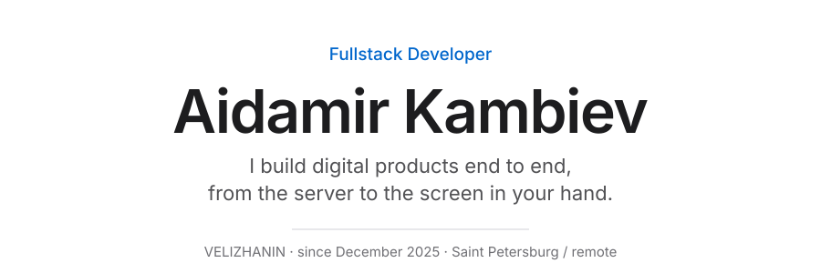

<picture>
  <source media="(prefers-color-scheme: dark)" srcset="assets/header-dark.svg">
  
</picture>

## About me

Fullstack developer with over two and a half years of commercial experience. I own the product
end to end: architecture and database design, REST APIs, backend and frontend,
third-party integrations, job queues, CI/CD, deployment and production support.

I have worked on payment systems, Telegram Mini Apps, SSR applications and
heavily integrated backend services. I run code reviews, mentored three junior
developers and introduced engineering standards. My own product reached 2,000+
users with a paying audience.

## What I do

**Backend and data** — REST APIs on NestJS, PostgreSQL schemas, job queues,
integrations and payments.

**Interfaces** — React and Next.js, SSR, Telegram Mini Apps.

**Infrastructure** — Docker, CI/CD on GitHub Actions, deployment and production
support.

## Now

**VELIZHANIN** · Fullstack Developer · since December 2025

Building the brand's whole product platform: server, Mini Apps and bots. A
platform for Telegram channel authors, with content management, scheduled
publishing and AI features.

What that involves

 

- Designed and built a NestJS REST API from scratch as domain modules: post
  catalogue, JWT auth through the Telegram Mini App, S3 media via presigned
  upload, asynchronous publishing on BullMQ and Redis, AI headline generation.
- Built one backend for two mobile apps, Telegram Mini Apps and a web admin,
  plus a Telegram bot builder. Developed two Telegram Mini Apps on React 19.
- Set up a pnpm and Turborepo monorepo with shared packages for security guards,
  HTTP bootstrap, health probes and S3. Wiring up a new app takes hours instead
  of days.
- Configured CI/CD on GitHub Actions: lint, typecheck, unit and e2e tests, build
  and automatic deployment. Regressions surface before merge; releases need no
  manual deploy.

**Stack** — TypeScript · NestJS · Prisma · PostgreSQL · Redis · BullMQ ·
React 19 · Vite · TanStack Query · S3 · Docker · Turborepo · GitHub Actions

## Selected work

| Project | Year | What it is |
| --- | --- | --- |
| **VELIZHANIN Platform** | 2026 | An API of five domain modules on one PostgreSQL, a Telegram Mini App for channel navigation, a separate client app and an admin panel with analytics. |
| **NeonVPN** | 2026 | My own subscription VPN across seven services. YooKassa billing with auto-renewal, automated access provisioning, 2,000+ users with a paying audience. |
| **FlowAi** | 2025 | An AI platform for sales quality control: backend for call recording processing, a chat streaming the model's answer over WebSocket, an admin panel and a client cabinet with JWT auth. |
| **Global Dent Club** | 2024 | Selling access to a private club through Telegram: configurable sales funnels, Bitrix24, GetCourse and YooKassa with recurring payments. |
| **ELEMENT Concept** | 2026 | A florist studio: a site moved off Tilda onto static plus Bun, and a Telegram Mini App shop with catalogue, cart and YooKassa checkout. |
| **Red Dragon Way** | 2026 | The site of an online Chinese language school. A trial-lesson request goes straight into the teachers' working chat. |
| **Keel** | 2026 | A VS Code extension over Ollama. The model runs locally and nothing leaves the machine; every write is shown as a diff before it happens. |

Earlier projects

 

- **InSpay** (2026) — a fintech platform on Vue.js: refactored the legacy
  frontend, moved the codebase to TypeScript, lifted state into Pinia. Time to
  ship new functionality dropped from 2–3 weeks to 2–3 days.
- **MonteMove** (2025) — an internal finance platform: cards, crypto wallets,
  balances and reporting. TypeScript backend with data parsers and a REST API,
  a Next.js frontend with complex forms and Zod validation, and a Telegram
  app on React.
- **ALEVROLLS** (2025) — a food delivery service on Next.js integrated with the
  iiko Cloud API: menu and orders from the accounting system, Telegram auth, a
  persistent cart and order history.
- **MOSK** (2025) — intake and moderation of event submissions for a Telegram
  channel: a Grammy and Bun bot, a Next.js admin panel and YooKassa payments.

## Stack

**Frontend** — React · Next.js · TypeScript · Vue.js · Tailwind CSS ·
Framer Motion · Zustand · TanStack Query · Vite

**Backend** — NestJS · Node.js · PostgreSQL · Prisma · Drizzle · Redis ·
Grammy · YooKassa · Zod · WebSocket · Rust · Axum · Bun

**Infrastructure** — Docker · Railway · Vercel · GitHub Actions · Nginx ·
Cloudflare · S3 · Ubuntu · Turborepo · pnpm

**Tools** — Tauri · Git · Biome · Vitest · Playwright · Sentry · Swagger ·
Postman · Linear · Notion

## Get in touch

Open to job offers and to project work: product development, architecture,
getting a project to production. I reply within a day.

[@aidamirrrrrr](https://t.me/aidamirrrrrr)
